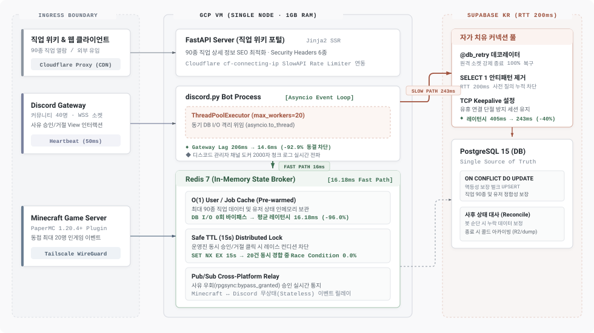

# RPG Sync Project

> **마인크래프트 RPG 서버 데이터 동기화 디스코드 봇 및 FastAPI 직업 위키 웹 포털**  
> *본 프로젝트는 **2026년 7월까지 가동된 실운영 서버 시스템(커뮤니티 유저 약 40명, 최대 동접 20명, 최대 90종 직업군 관리)**으로, 단일 노드(GCP Free Tier, 1GB RAM)와 대륙 간 네트워크 지연(GCP 미국 ↔ Supabase 한국, RTT 200ms) 환경에서 **다중 프로세스 격리와 DB I/O 0화**를 달성한 엔지니어링 프로젝트입니다.*

---

## 핵심 실측 성과

| 핵심 검증 영역 | 개선 전 | 적용 후 | 핵심 성과 및 실측 수치 |
|---|---|---|---|
| **물리적 RTT 200ms 극복** | 405.66 ms | **16.18 ms** (Redis Fast Path) | **평균 지연시간 96.0% 단축** (DB I/O 0화 및 TCP 예열) |
| **이벤트 루프 동결 방지** | 206.04 ms (지터) | **14.64 ms** (지터) | **하트비트 지터 92.9% 억제** (게이트웨이 1006 연결 끊김 차단) |
| **경합 동시성 무결성** | 경쟁 상태 발생 | **오류율 0.0% (20건 중 1건 승인)** | 15초 Safe TTL 분산 락으로 운영진 중복 클릭 완전 차단 |
| **원격 소켓 단절 복구** | 서버 비정상 다운 | **자동 복구 100.0% (6회 전원 성공)** | `@db_retry` 기반 끊긴 소켓 폐기 및 1회 재연결 자가 치유 |

---

## 시스템 아키텍처

<p align="center">
  <picture>
    <source media="(prefers-color-scheme: dark)" srcset="public/images/architecture-dark.svg">
    
  </picture>
</p>

---

## 개발 배경 및 문제 정의

* **정적 사이트의 한계 극복**:
  * 기존 레거시 정적 위키([`jaeunify/do-it-minecraft-fossile`](https://github.com/jaeunify/do-it-minecraft-fossile))는 직업 데이터나 밸런스 패치 시마다 프론트엔드 소스 코드를 직접 수정해 재배포해야 했으며, 인게임 데이터와의 실시간 동기화가 불가능했습니다.
  * 본 프로젝트는 이를 데이터베이스 중심 아키텍처로 전면 재설계하여, 데이터 수정 즉시 웹 위키와 인게임에 무중단 반영되는 동적 시스템을 구축했습니다.
* **운영진 온보딩 병목 자동화**:
  * 신규 유입 유저의 접속 사유 검토와 화이트리스트 등록을 운영진이 수작업으로 처리하던 반복 업무 병목을 디스코드 봇 컴포넌트와 연동해 자동화했습니다.
* **1인 단독 엔지니어링**:
  * Java 기반 PaperMC 마인크래프트 플러그인부터 Discord 봇, FastAPI 웹 백엔드, 프론트엔드 UI, 클라우드 인프라 배포까지 시스템 전 계층을 1인 단독으로 설계하고 구현했습니다.

---

## 실운영 규모 및 인프라 제약

* **운영 타임라인**: 2026년 4월 개발 착수 (내부 프로토타입 온보딩 위키 운용) → 프론트엔드 개편 및 커뮤니티 공개 홍보 → 2026년 7월 서비스 종료
* **운영 인력 및 커뮤니티 규모**:
  * **엔지니어링**: 1인 단독 개발 (전 계층 자체 구현)
  * **운영진(스태프)**: 5~6명 (신규 유저 심사 및 접속 사유 우회 승인/거절 권한 동시 행사)
  * **디스코드 커뮤니티 유저**: 약 40명
  * **최대 동시 접속자**: 20명
  * **관리 직업 데이터셋**: 최대 약 90종 (스토리 내 등장인물 기반 직업군)
* **인프라 제약 및 FinOps ($0 운영)**:
  * **호스트 인프라**: GCP Compute Engine Free Tier `e2-micro` (vCPU 2개, **1.0GB RAM**, 미국 오리건 리전)
  * **원격 데이터베이스**: Supabase PostgreSQL 15 (서울 리전, 미국 ↔ 한국 물리적 RTT 200ms)
  * **월 인프라 청구 비용**: **0원 (월 10원 미만)** — GCP 무료 티어와 Supabase 프리 티어를 최적화하여 도메인 구입비 외 순수 클라우드 유지 비용 $0 달성
* **웹 포털 구축 및 트래픽 수용**:
  * 인게임에 접속하지 않은 외부 유저에게 **직업 위키 웹 포털**을 제공해 신규 유입과 온보딩 접근성을 확보.
  * 검색 엔진 최적화(SEO)와 Cloudflare CDN 캐싱을 결합해 불특정 다수의 유입 트래픽 수용.

---

## 5대 도메인 벤치마크 실증 결과

실제 도커 인프라(`postgres:15-alpine`, `redis:7-alpine`, `FastAPI`)에 부하와 결함을 직접 주입하며 메트릭을 계측했습니다.

| 벤치마크 항목 | 핵심 검증 주제 | 실측 조건 및 부하 구성 | 상세 실증 보고서 |
|---|---|---|---|
| **Part 1. 네트워크 & DB** | RTT 200ms 극복과 커넥션 풀 자가 치유 | `data.js` 71종 직업 데이터셋 무작위 질의, RTT 200ms 모의 주입, `pg_terminate_backend` 강제 소켓 종료 | [`PART1_CONNECTION_POOL.md`](portfolio/benchmarks/PART1_CONNECTION_POOL.md) |
| **Part 2. 동시성 & 락** | 비동기 이벤트 루프 격리와 Safe TTL 분산 락 | 50ms 주기 Discord WebSocket 하트비트 지터 계측, 동일 키 20개 코루틴 동시 경합 | [`PART2_EVENT_LOOP_AND_LOCK.md`](portfolio/benchmarks/PART2_EVENT_LOOP_AND_LOCK.md) |
| **Part 3. 웹 보안** | Pure ASGI 미들웨어와 도메인 경계 보호 | 보안 헤더 6종 주입, HSTS 로컬 배제, CSRF Origin 경계 검증, Redis 연동 Client IP 레이트 리미팅 | [`PART3_WEB_SECURITY.md`](portfolio/benchmarks/PART3_WEB_SECURITY.md) |
| **Part 4. 데이터 무결성** | 비정형 텍스트 정형화와 일괄 적재 파이프라인 | 디스코드 비정규 포스트 계층형 버퍼 파싱, `jobs` 100회 일괄 UPSERT, JSONB 닉네임 템플릿 영속화 | [`PART4_DATA_INTEGRITY_AND_PARSER.md`](portfolio/benchmarks/PART4_DATA_INTEGRITY_AND_PARSER.md) |
| **Part 5. 분산 이벤트** | 크로스 플랫폼 이벤트 브로커와 봇 순단 사후 대사 | Redis Pub/Sub 종단간 전달 지연시간 계측, 봇 오프라인 순단 시 누락 이벤트 PostgreSQL 사후 대사 | [`PART5_DISTRIBUTED_PUBSUB.md`](portfolio/benchmarks/PART5_DISTRIBUTED_PUBSUB.md) |

---

## 핵심 엔지니어링 전략 및 구현 원리

### 1. 물리적 네트워크 지연(RTT 200ms) 극복과 자가 치유 커넥션 풀
* **문제 상황**: 미국 리전(GCP VM)과 한국 리전(Supabase PG) 간의 물리적 거리(RTT 200ms) 때문에, 쿼리 직전 연결을 확인하는 `SELECT 1` 방식은 매 호출마다 400ms 이상의 지연을 누적시켰습니다. 또한 Supabase가 유휴 연결을 끊을 때 클라이언트 메모리 플래그(`conn.closed`)가 이를 감지하지 못해(`conn.closed == 0`) 런타임 쿼리 오류가 발생했습니다.
* **해결 방식**:
  * `SELECT 1` 사전 검증을 제거하고 커널 레벨 TCP Keepalive를 적용해 세션을 안정적으로 유지했습니다.
  * `@db_retry` 데코레이터를 구현해 `psycopg2.OperationalError`나 `DatabaseError` 발생 시 끊어진 소켓을 풀에서 영구 폐기(`putconn(close=True)`)하고 즉시 재연결해 1회 재시도(Fail-fast Auto-Reconnect)하도록 구성했습니다.
  * 봇 기동 시 단 한 번의 벌크 쿼리로 유저와 직업(최대 90종) 데이터를 Redis에 사전 예열(Pre-warming)하여 반복 조회를 인메모리 Fast Path로 전환했습니다.
* **성과**:
  * 일반 쿼리 지연시간을 **405.66ms에서 243.41ms로 40.0% 단축**했습니다.
  * Redis Fast Path 적용 시 지연시간을 **16.18ms로 96.0% 단축하고 처리량을 2401.2% 향상**시켰습니다.
  * 서버 소켓 강제 종료 상황에서 **자가 치유 성공률 100.0% (6회 중 6회 전원 복구)**를 달성했습니다.

### 2. 이벤트 루프 기아 방지와 ThreadPoolExecutor 격리
* **문제 상황**: `discord.py`는 단일 비동기 이벤트 루프 기반으로 동작합니다. 동기식 DB 쿼리(`psycopg2`)가 루프를 200ms 이상 점유하면 게이트웨이 하트비트 전송이 지연되어 `1006 Connection Closed` 에러와 함께 재연결 루프에 빠집니다.
* **해결 방식**:
  * 비동기 메인 루프에 전용 `ThreadPoolExecutor(max_workers=20)`를 결합하고, 모든 동기 DB I/O 작업을 `await asyncio.to_thread`로 위임해 완전히 격리했습니다.
* **성과**:
  * 10회 동시 DB 쿼리 부하 환경에서 하트비트 지터를 **206.04ms에서 14.64ms로 92.9% 억제**했습니다.
  * 전체 처리 소요 시간을 **2.495초에서 0.358초로 85.7% 단축하며 27.94 RPS**를 확보했습니다.

### 3. 1GB RAM 단일 노드 환경의 15초 Safe TTL 경량 분산 락
* **문제 상황**: 여러 운영진이 디스코드 채널에서 유저의 접속 사유 우회(`ReasonBypassView`) 버튼(승인/거절)을 동시에 클릭하면 중복 처리(경쟁 상태)가 발생할 수 있습니다. 하지만 1GB 단일 VM 환경에서 Redlock이나 백그라운드 Watchdog 프로세스를 운용하면 메모리 고갈 위험이 컸습니다.
* **해결 방식**:
  * Redis 단일 노드의 원자적 명령어인 `SET key val EX 15 NX`를 채택했습니다. 임계 구역 처리 시간(약 50ms) 대비 300배의 안전 마진을 둔 15초 Safe TTL을 설정하고, 처리가 끝나면 명시적으로 `DEL`하는 경량 동시성 제어를 설계했습니다.
* **성과**:
  * 20개 세션 동시 요청 경합 환경에서 **정확히 1건 승인, 19건 차단(오류율 0.0%)**으로 무결성을 검증했습니다.

### 4. Pure ASGI 미들웨어 웹 보안과 IP 기반 트래픽 제어
* **문제 상황**: 불특정 다수가 접속하는 직업 위키 웹 포털 특성상 무차별 크롤링이나 비정상 트래픽이 유입될 수 있습니다. 또한 리버스 프록시(Cloudflare) 뒤에서 실제 클라이언트 IP를 식별하지 못하면 레이트 리미팅이 무력화됩니다.
* **해결 방식**:
  * Starlette/FastAPI 기반의 순수 ASGI 미들웨어를 구축해 필수 보안 헤더 6종(`X-Frame-Options: DENY`, `Content-Security-Policy: frame-ancestors 'none'`, `X-Content-Type-Options: nosniff`, `Referrer-Policy`, `Permissions-Policy`, `X-Process-Time`)을 자동 주입했습니다.
  * Cloudflare의 `cf-connecting-ip` 헤더를 검증해 신뢰할 수 있는 클라이언트 IP를 기준으로 Redis 연동 SlowAPI 레이트 리미팅을 적용했습니다.
* **성과**:
  * 모든 위키 엔드포인트에 보안 헤더 100% 주입을 확인했고, 임계치를 넘긴 요청을 `HTTP 429 Too Many Requests`로 차단했습니다.

### 5. Redis Pub/Sub 이벤트 브로커와 연결 단절 시 사후 상태 대사
* **문제 상황**: 외부 마인크래프트 서버와 디스코드 간 실시간 이벤트 동기화에 Redis Pub/Sub을 사용할 때, 봇 프로세스 순단이나 네트워크 단절이 발생하면 인메모리 메시지가 유실될 위험이 있었습니다.
* **해결 방식**:
  * Redis Pub/Sub은 빠른 실시간 통지용 통로로 활용하고, 최종 진실의 원천은 PostgreSQL에 두었습니다.
  * 봇 기동 및 재연결 시 `users` 테이블의 `is_guide_completed` 및 권한 상태를 조회해 미처리 이벤트를 한 번에 맞추는 사후 상태 대사 파이프라인을 구현했습니다.
* **성과**:
  * 봇 다운 상태에서 인입된 20건의 완료 이벤트에 대해 재기동 시 단 1회의 대사 쿼리로 **누락 없이 100% 복구 및 동기화**를 완료했습니다.

---

## 장애 관제 및 서비스 종료 아카이빙

### 1. 실시간 디스코드 도커 로그 관제
* **배경**: 1GB 단일 VM 환경에서 무거운 로깅 스택을 띄우는 것은 메모리 낭비였고, 매번 SSH 터미널에 접속해 `docker logs`를 확인하는 방식은 신속한 장애 대응에 불리했습니다.
* **구현**: 
  * Docker 컨테이너의 표준 출력/에러 스트림을 디스코드 최대 메시지 길이(2,000자) 단위로 분할하여 관리자 전용 디스코드 관제 채널로 실시간 전송했습니다.
  * 별도 모니터링 인프라 없이도 모바일과 데스크톱 디스코드에서 봇 크래시나 `@db_retry` 경고 로그를 즉각 확인했습니다.

### 2. 서비스 정상 종료 및 콜드 아카이빙 파이프라인 ([`db_backup.py`](db_backup.py))
* **배경**: 2026년 7월 서비스 종료 시 운영 데이터를 유실 없이 영구 보존하기 위해 정적 콜드 아카이빙 파이프라인을 구축했습니다.
* **구현**:
  * Cloudflare R2 도메인 매칭 정규식 필터링으로 검증된 정적 이미지만 선별 다운로드했습니다.
  * `DateTimeEncoder` 커스텀 직렬화를 거쳐 PostgreSQL의 관계형 테이블과 JSONB 필드를 전수 덤프해 정적 아카이브 디렉토리(`public/archive/`)로 백업 전환했습니다.

---

## 프로젝트 구조

```
rpg_sync_project/
├── src/
│   ├── bot/                # Discord.py 봇 메인 (이벤트 루프, Cogs, 스레드 풀 격리)
│   │   ├── cogs/           # 도메인별 Cog (auth, board, jobs, system, users)
│   │   └── utils/          # 계층형 버퍼 텍스트 파서, S3 클라이언트, 권한 체크
│   ├── database/           # PostgreSQL 커넥션 풀 (@db_retry 자가 치유) 및 Redis 캐시 계층
│   └── web/                # FastAPI 웹 포털 (직업 위키, Pure ASGI 보안 미들웨어, SlowAPI, SSR)
│       ├── routers/        # 인증, 대시보드, 직업 위키, 가이드 라우터
│       └── templates/      # Jinja2 서버사이드 렌더링 템플릿
├── public/                 # 정적 자산 및 아키텍처 다이어그램 SVG (Light/Dark)
│   └── images/
│       ├── architecture-light.svg
│       └── architecture-dark.svg
├── portfolio/              # 포렌식 개발 로그, 아키텍처 백서, 트러블슈팅 가이드
│   ├── benchmarks/         # 5대 도메인별 벤치마크 실증 보고서 (Part 1 ~ Part 5)
│   └── TROUBLESHOOTING.md  # 실제 발생 장애 및 4대 핵심 트러블슈팅 케이스
├── tests/                  # 재현 가능한 벤치마크 계측 스크립트 5종
├── db_backup.py            # 서비스 종료 시 R2 이미지 백업 및 DB JSON 덤프 스크립트
├── docker-compose.yml      # 프로덕션 컨테이너 정의
├── docker-compose.dev.yml  # 로컬 실증용 DB & Redis 인프라 정의
├── init.sql                # PostgreSQL 15 초기 스키마 및 인덱스 정의
└── requirements.txt
```

---

## 핵심 트러블슈팅 사례 요약

상세 트러블슈팅 로그와 코드 해결책은 [`portfolio/TROUBLESHOOTING.md`](portfolio/TROUBLESHOOTING.md)에서 확인할 수 있습니다.

1. **Supabase 유휴 연결 강제 종료와 `conn.closed` 감지 불가**
   * *원인*: 원격 방화벽/프록시가 소켓을 비정상 종료했을 때 클라이언트 메모리 플래그(`conn.closed`)가 `0`으로 남아 장애 감지를 우회했습니다.
   * *해결*: `@db_retry` 데코레이터를 적용해 `psycopg2.OperationalError` 발생 시 끊긴 소켓을 폐기하고 1회 재연결하는 자가 치유 체계를 구축했습니다.
2. **동기 I/O 쿼리로 인한 Discord Gateway Heartbeat Starvation**
   * *원인*: 200ms RTT DB 쿼리가 단일 비동기 이벤트 루프를 블로킹해 하트비트 전송 누락과 `1006` 연결 끊김이 발생했습니다.
   * *해결*: 메인 루프에 전용 `ThreadPoolExecutor(max_workers=20)`를 할당하고 `asyncio.to_thread`로 위임해 하트비트 지터를 14.6ms로 억제했습니다.
3. **AI 생성 코드 수용 시 발생한 웹 보안 취약점 (SQLi & DOM XSS)**
   * *원인*: 초기 프로토타입 개발 시 f-string 쿼리와 CSR 구조를 도입해 보안 취약점이 노출되었습니다.
   * *해결*: 전체 DB 쿼리를 파라미터 바인딩으로 전면 강제하고 Jinja2 SSR로 전환해 공격 표면을 원천 차단했습니다.
4. **1GB RAM VM 환경에서 유저 사유 우회 중복 클릭 경쟁 상태**
   * *원인*: 여러 운영진이 동일 유저의 접속 사유(`ReasonBypassView`)를 동시에 승인/거절할 때 분산 경쟁 상태가 발생했습니다.
   * *해결*: Watchdog 프로세스의 메모리 부담을 배제하고 15초 Safe TTL 기반 `SET NX EX` 분산 락을 설계해 중복 처리를 0건으로 막았습니다.

---

## 로컬 재현 및 벤치마크 실행 방법

로컬 도커 테스트베드 환경에서 모든 수치를 직접 재현하고 계측할 수 있습니다.

```powershell
# 1. 로컬 테스트 인프라 기동 (PostgreSQL 15 & Redis 7)
docker compose -f docker-compose.dev.yml up -d db redis

# 2. Part 1: 커넥션 풀 자가 치유 및 레이턴시 벤치마크 실행
uv run --with psycopg2-binary --with redis --with python-dotenv python tests/benchmark_connection.py

# 3. Part 2: 이벤트 루프 격리 및 Safe TTL 분산 락 동시성 벤치마크 실행
uv run --with psycopg2-binary --with redis --with python-dotenv python tests/benchmark_event_loop.py

# 4. Part 3: 웹 보안 미들웨어 및 레이트 리미팅 벤치마크 실행
docker compose -f docker-compose.dev.yml up -d api
uv run --with httpx --with pytest python tests/benchmark_web_security.py

# 5. Part 4: 계층형 버퍼 파서 및 벌크 UPSERT 벤치마크 실행
uv run --with psycopg2-binary --with python-dotenv python tests/benchmark_data_integrity.py

# 6. Part 5: 크로스 플랫폼 Pub/Sub 및 사후 대사 벤치마크 실행
uv run --with redis --with psycopg2-binary --with python-dotenv python tests/benchmark_pubsub.py

# 7. 인프라 종료
docker compose -f docker-compose.dev.yml stop
```

